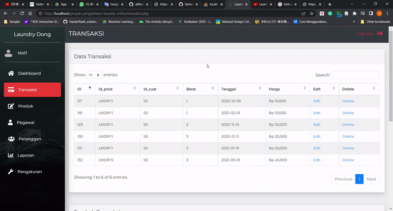
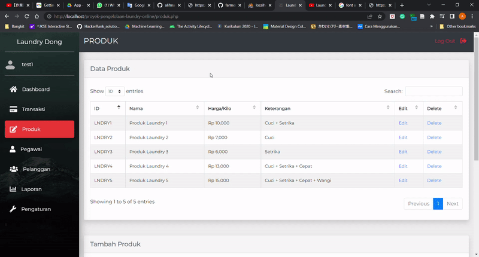
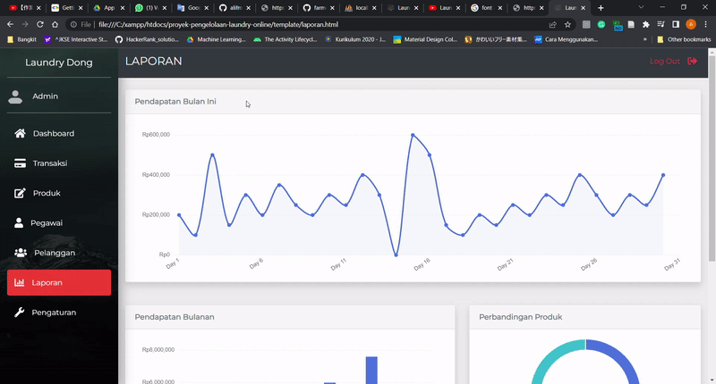

# proyek-pengelolaan-laundry-online

This project aims to create a web-based laundry management application with the aim of helping laundry entrepreneurs manage their business.

Tthis application has the following features:
- manage (add, edit, delete employees)
- Laundry transactions with payment status and order status
- Setting the price of laundry services
- Manage customers(add, edit, delete customers)
- Report

Build with:
- PHP
- HTML
- CSS
- JavaScript

## Run on Your Computer
Prerequisite:
- [XAMPP installed](https://www.apachefriends.org/download.html) 
- [Git installed](https://git-scm.com/downloads)

How to run this repository on your computer:
- Open htdocs folder (location example: C:\xampp\htdocs)
- Open Git Bash terminal
- Type 'git clone git@github.com:alifmaulanarizqi/proyek-pengelolaan-laundry-online.git' or 'git clone https://github.com/alifmaulanarizqi/proyek-pengelolaan-laundry-online.git'
- It will clone this repository to your local computer, after cloning process is finished you can open it code editor
- Start Apache and MySQL on XAMPP
- Import laundry.sql file in phpMyAdmin ([Tutorial](https://www.youtube.com/watch?v=rt3Ru9-LHnY))
- Open browser, paste 'http://localhost/proyek-pengelolaan-laundry-online'

## Demo    

    
    
  

